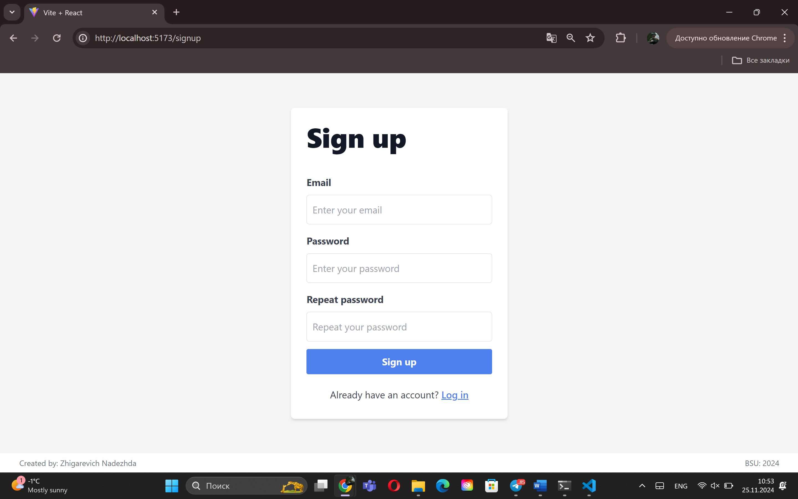
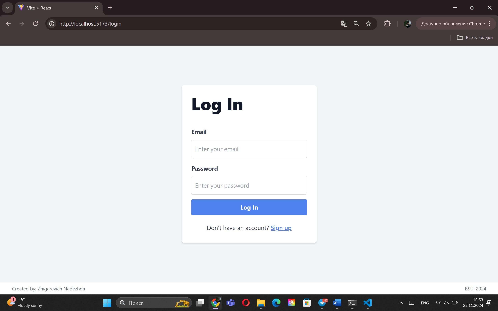
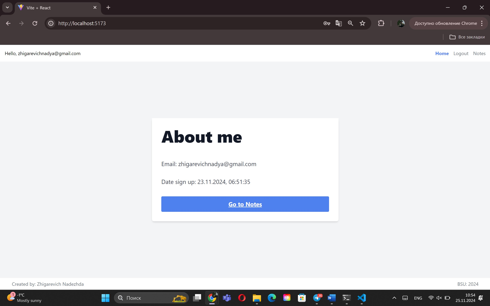
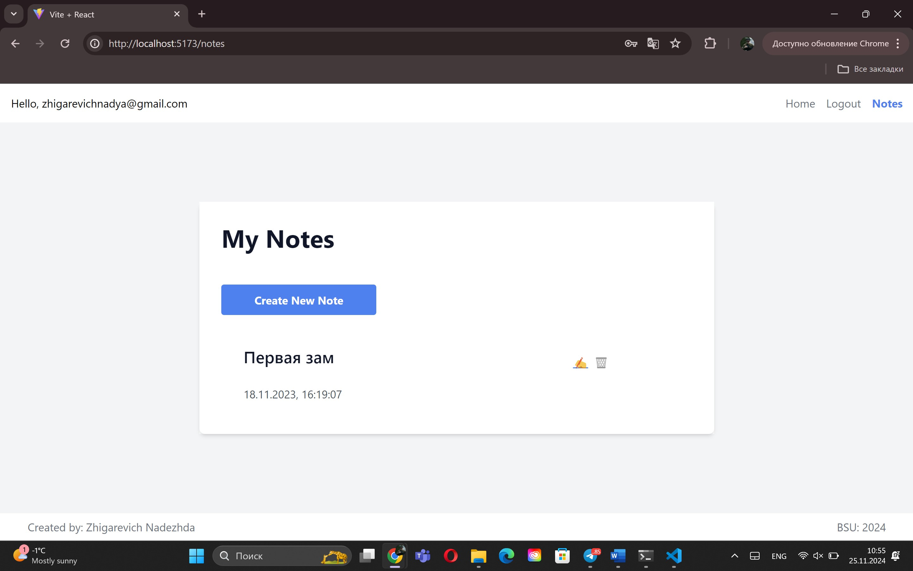
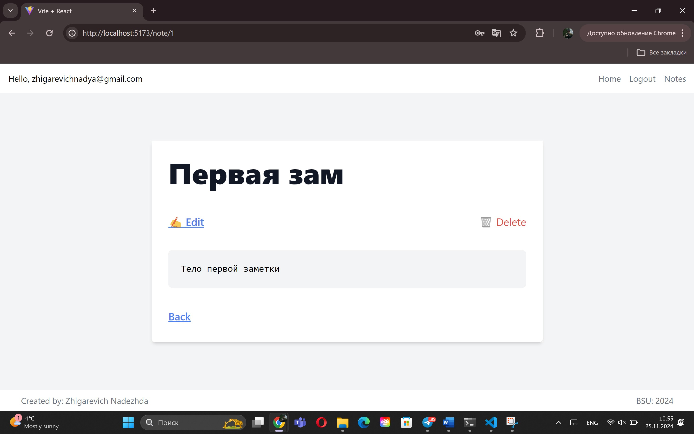
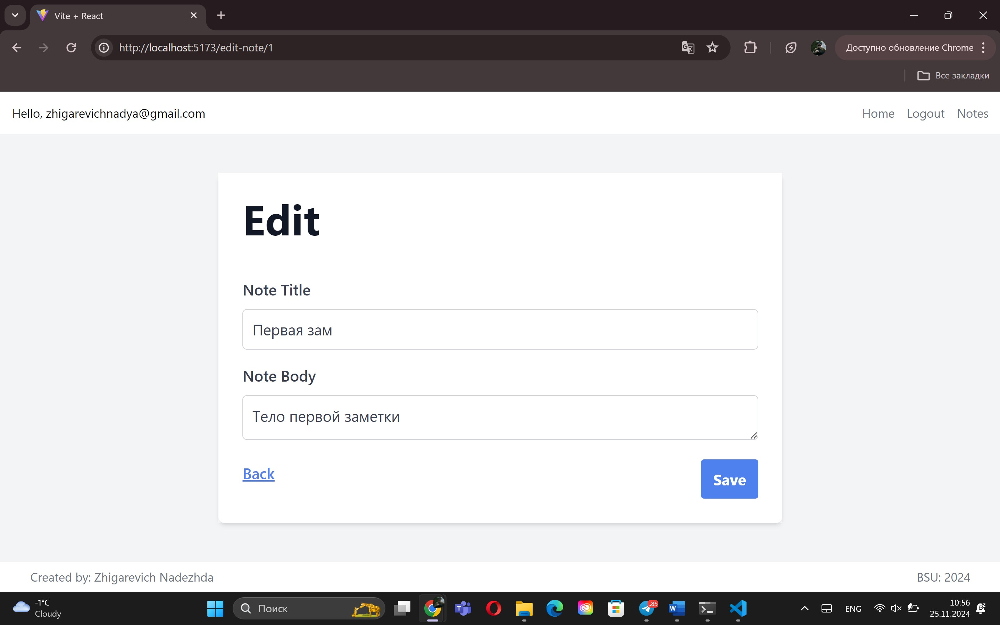

# Notion

This project allows you to create, edit and store notes.

## Project Setup

To run this project, follow these steps:

1. Clone the repository.
2. Build and run the project.

## Main Web API Functionality

### Post Information

1. Retrieve a list of all notes.
2. Get a specific note by its ID.
3. Add a new note.
4. Update information about an existing note.
5. Delete a note.


### Authentication / Authorization

1. Register new user.
2. Login user.

## Technologies Used

1. **React.js**
2. **Json-server**
3. **React-router-dom**
4. **Zod**
5. **Tailwind.css/typography** 
6. **Redux** 

### How to start application?

1) Clone project

```
git clone https://github.com/nadyazhigarevich/notion-redux
```

2) Build project
```
npm install
```

3) Run client
```
npm run dev
```
4) Run server
```
npm run dev:db
```
### There are some screens:





